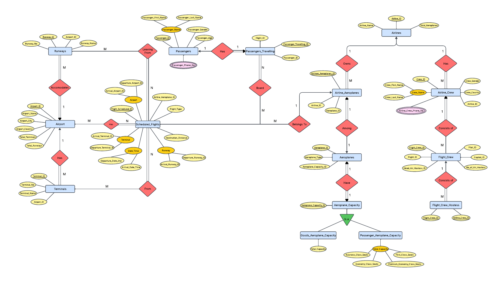

# Flight Management System (Oracle SQL/PLSQL)

A robust database management solution for **airline operations**, implemented using **Oracle SQL and PL/SQL**. The system manages **flight scheduling, passenger bookings, crew assignments, aeroplane capacities, and airport infrastructure**, ensuring **data integrity, automated validation, and efficient reporting**.

---

## Features
- **Normalized Database Design** (BCNF) with 16+ tables ensuring consistency and scalability.  
- **Stored Procedures** for automated tasks such as:
  - Inserting passengers and crew with phone numbers.  
  - Generating tickets.  
  - Calculating aeroplane capacities.  
  - Querying flight schedules and passenger details.  
- **Validation Triggers** to enforce business rules:
  - Valid flight types (Domestic vs. International).  
  - Proper crew assignments.  
  - Valid phone number formats and non-zero capacities.  
- **Comprehensive Reporting** using SQL queries and PL/SQL blocks.

---

## Technologies Used
- **Oracle SQL** – Data definition, constraints, and relationships.  
- **PL/SQL** – Stored procedures, triggers, and business logic.  
- **Database Normalization** – BCNF for efficient and scalable design.

---

## Project Structure

```
├── DBMS Project Report (Flight Management System).pdf   # Detailed project report
├── Table Creation/                                      # SQL scripts for table creation
├── Data Insertion/                                      # Procedures for data insertion
├── Deletion Procedures/                                 # Procedures for record deletion
├── PK Triggers/                                         # Primary key validation triggers
├── FK Triggers/                                         # Foreign key validation triggers
├── Triggers for Insertion/                              # General-purpose insert triggers
├── Triggers for Deletion/                               # General-purpose delete triggers
├── Insertion Procedures/                                # Organized scripts for insertion logic
├── PK Select Procedures/                                # Retrieval procedures by primary key
├── User Defined Procedures/                             # Custom business logic procedures
├── User Defined Insertion/                              # Additional custom insertion logic
├── User Defined Triggers/                               # Custom validation triggers
├── Select * Procedures/                                 # Procedures to retrieve all records
└── README.md                                            # Project documentation (this file)
```

---

## How to Run

1. **Set up Oracle Database**
   - Option 1: Install Oracle Database locally and use **SQL*Plus** or **Oracle SQL Developer**.
   - Option 2: Use **Oracle Live SQL** (https://livesql.oracle.com/) for running scripts online.

2. **Create Database Schema**
   - Navigate to the `Table Creation/` folder and run all SQL scripts to create the normalized database tables.

3. **Add Constraints and Triggers**
   - Execute scripts in `PK Triggers/` and `FK Triggers/` to enforce primary key and foreign key constraints.
   - Run scripts in `Triggers for Insertion/`, `Triggers for Deletion/`, and `User Defined Triggers/` to enable business rule validations.

4. **Load Data**
   - Run scripts in `Data Insertion/`, `Insertion Procedures/`, and `User Defined Insertion/` to populate the database.

5. **Enable Procedures**
   - Execute procedures from `User Defined Procedures/`, `PK Select Procedures/`, and `Select * Procedures/` for operations like ticket generation, passenger retrieval, and flight capacity checks.

6. **Test the System**
   - Use SQL queries from `Select * Procedures/` or create your own queries to verify database functionality.

---

## ER Diagram


---

## Conclusion
This project delivers a **scalable and reliable flight management database** for airline administrators and airport staff. It demonstrates:
- Strong **SQL/PLSQL skills**.  
- **Database normalization and optimization**.  
- **Real-world business rule implementation** via triggers and procedures.

**Future Enhancements:**
- Web/mobile user interface integration.  
- Real-time flight tracking.  
- Payment gateway integration.  
- Advanced analytics for optimization.

---

## Author
Hardik Tandon – [GitHub](https://github.com/HardikTandon77)
